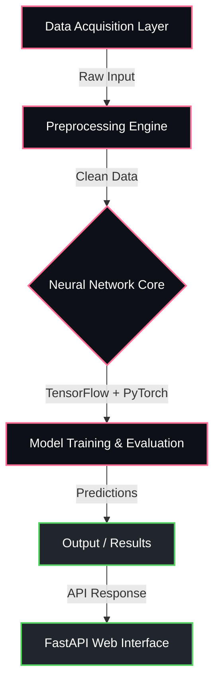

<div align="center">


<p align="center">
  
  
  
  
</p>

  
  
  


</div>

---

## Overview

> Big data analytics engine for processing massive high-dimensional datasets.

**High Dimensional Data Clustering Framework on Cloud with Deep AI** is a proprietary machine learning / ai system engineered by **Karthik Idikuda**. It leverages FastAPI, PyTorch, TensorFlow for its core functionality.

<br/>

## System Architecture



<br/>

## Project Structure

```
High-Dimensional-Data-Clustering-Framework-on-Cloud-with-Deep-AI/
  .env.example
  .gitignore
  DATABASE_FREE_README.md
  Dockerfile
  FREE_SETUP_GUIDE.md
  GUI_README.md
  LICENSE
  README.md
  cluster_simple.py
  clustering_gui.py
  configs/
    deep_embedding_config.yaml
  data/
    sample_data.csv
    sample_data_gui.csv
  notebooks/
    clustering_analysis.ipynb
  results/
    clustered_data_acb3a0ad.csv
    clustered_data_c91df9ae.csv
    clustered_data_cbefa4dc.csv
    clustered_data_e72627ad.csv
    results_c91df9ae.json
  scripts/
    deploy_azure.ps1
    deploy_azure.sh
    generate_sample_data.py
  src/
    config.py
    main.py
  tests/
    test_clustering.py
  web-dashboard/
    package.json
```

<br/>

## Technical Specifications

| Attribute | Detail |
|:---|:---|
| **Primary Language** | `Python` |
| **Project Category** | `Machine Learning / AI` |
| **Total Source Files** | `49` |
| **Frameworks** | `FastAPI`, `PyTorch`, `TensorFlow` |
| **Key Dependencies** | `torch` | `scikit-learn` | `plotly` | `tensorflow` | `hdbscan` | `seaborn` | `pandas` | `spectral-clustering` | `pyclustering` | `azure-functions` | `matplotlib` | `keras` | `numpy` | `azure-storage-blob` | `azure-servicebus` |
| **Intellectual Property** | `Strictly Proprietary` |

<br/>

## STRICT LEGAL WARNING & LICENSE

> **PROPRIETARY AND CONFIDENTIAL**

This software and all associated documentation are the **exclusive property of Karthik Idikuda**.

- **NO PERMISSION IS GRANTED** to use, copy, modify, merge, publish, distribute, sublicense, or sell copies of this software without explicit, written consent from the author.
- **UNAUTHORIZED USE WILL RESULT IN SEVERE LEGAL ACTION.** Any individual or organization found using, referencing, or deploying this code without paying the required licensing fees will face immediate litigation, financial penalties, and potentially criminal prosecution where applicable by law.
- **TO OBTAIN A LEGAL LICENSE**, you must directly contact Karthik Idikuda to negotiate payment terms.

*By accessing this repository, you acknowledge and accept these strict proprietary terms.*

---

<div align="center">
  
</div>

<!-- TRACKING: S0ktSGlnaC1EaW1lbnNpb25hbC1EYXRhLUNsdXN0ZXJpbmctRnJhbWV3b3JrLW9uLUNsb3VkLXdpdGgtRGVlcC1BSS1UUkFDSw== -->
